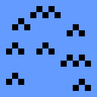

# Elements - Game Design Document

Este documento visa definir as especificações gerais para o desenvolvimento do jogo provisóriamente nomeado como ```Elements```, suas regras de jogo e recursos necessários.

## Definição


- **Gênero:** Quebra-cabeças / Sokoban
- **Plataformas:** Windows, Linux
- **Mecânica principal:** Troca de elementos para resolução de fases

# Conteúdos:
- [Elements - Game Design Document](#elements---game-design-document)
  - [Definição](#definição)
- [Conteúdos:](#conteúdos)
- [Gameplay](#gameplay)
  - [Fase](#fase)
    - [Bloco](#bloco)
    - [Item](#item)
    - [Personagem](#personagem)
  - [Elementos](#elementos)
    - [Grama](#grama)
    - [Água](#água)
    - [Fogo](#fogo)
    - [Neutro / Sem elemento](#neutro--sem-elemento)
  - [Personagens](#personagens)
    - [Jogador](#jogador)
      - [Controle](#controle)
    - [Inimigos](#inimigos)
  - [Itens](#itens)
    - [Itens Elementais](#itens-elementais)
    - [Chave](#chave)
  - [Blocos não elementais](#blocos-não-elementais)
    - [Parede](#parede)
    - [Porta](#porta)
- [Recursos](#recursos)
  - [Sons](#sons)
  - [Música](#música)
  - [Telas](#telas)


# Gameplay

## Fase

Uma fase é composta de três tipos de objeto:
- [Bloco](#bloco)
- [Item](#item)
- [Personagem](#personagem)

Em todas as fases, o objetivo é chegar na bandeira. Ao colidir com ela, o jogador é enviado para a próxima fase.

Para que os comportamentos de objeto aconteçam, o jogador deve pressionar o botão para se mover, quando acontece, é chamada a função de atualização dos objetos, nesta ordem:
1. Jogador
2. Itens
3. Inimigos
4. Blocos

### Bloco

Blocos são objetos com interações limitadas e específicas entre sí, com gatilhos básicos para sua funcionalidade.

- Exemplos:
  - Bloco de grama
  - Porta
  - Objetivo.

### Item

Objetos itens pelo jogador, apenas executam sua função de atualização quando colididos pelo jogador, após isso são destruídos. Nenhum bloco ou inimigo pode ser gerado ou se mover na posição deles.

- Exemplos:
  - Chave
  - Peixe
  - Vela

### Personagem

Objetos que se movem pela fase vertical e/ou horizontalmente e possuem interações específicas com os elementos e seus blocos.

## Elementos


Os elementos possuem seguem a filosofia do clássico pedra-papel-tesoura, onde cada um deles vence um outro. Cada um deles possui uma mecânica única a ser seguida pelos personagens (Tanto jogador quanto inimigos). São Eles:

### Grama


- **Vence contra:** Água
- **Perde contra:** Fogo

A mecânica principal deste elemento é o bloco de grama, que não pode ser empurrado por personagens de outros elementos.

>**Não** é possível empurrar dois blocos de grama simultaneamente, mesmo que o personagem tenha como elemento Grama.

> Quando um bloco de grama entra em contato com um bloco de água, **ambos** são destruidos.

> Quando um personagem de grama entra em contato com fogo, é eliminado.

> Quando um personagem de grama entra em contato com um personagem de água, o destrói.

### Água



- **Vence contra:** Fogo
- **Perde contra:** Grama

A mecânica principal deste deste elemento é o bloco de água, que elimina personagens que tente atravessá-lo quando seu elemento não é água.

> Personagens de água **apagam** (destroem) blocos de fogo ao atravessá-los.

> Quando um bloco de grama entra em contato com um bloco de água, **ambos** são destruidos.

> Quando um personagem de água entra em contato com um personagem de grama, é destruído.

> Quando um personagem de água entra em contato com um personagem de fogo, o destrói.

### Fogo


- **Vence contra:** Água
- **Perde contra:** Grama

A mecânica principal deste elemento é o bloco de fogo, que elimina personagens que tentam atravessar (que não sejam de fogo ou água).

> Blocos de fogo se expandem a cada movimento, ou seja, geram mais quatro blocos de fogo nas posições imediatas disponíveis (cima, baixo, esquerda e direita).

> Blocos de fogo podem ser gerados na posição de um personagem. Caso o personagem não seja de fogo ou água, ele é eliminado.

> Blocos de fogo podem ser gerados na posição de um bloco de grama, nesse caso, o bloco de grama é destruído.

> Ao entrar em contato com um personagem de água, o personagem de fogo é eliminado.

> Ao entrar em contato com um personagem de grama, o personagem de fogo elimina-o.

### Neutro / Sem elemento


- **Vence contra:** Nenhum
- **Perde contra:** Água, Fogo, Grama

Elemento/estado **exclusivo** do **jogador**, inicia os níveis neste estado.

> É destruído ao entrar em contato com personagens dos outros elementos.

## Personagens

### Jogador


O jogador é a peça principal do jogo, a partir dele a maior parte das interações ocorre. Durante o jogo, pode coletar itens para que mude seu elemento.

> O jogador sempre inicia a fase em seu estado Neutro (Sprite da direita), suas interações descritas em [Elemento Neutro](#neutro--sem-elemento).

> Todas os comportamentos de entidades ocorrem apenas quando o jogador se move, com ele tendo prioridade máxima no movimento.

#### Controle

O jogador é controlado pelas teclas directionais do teclado, ao pressiona-las ele se move.

### Inimigos


Inimigos seguem uma linha de movimento simples que pode ser vertical ou horizontal.

> Andam na direção inicial até encontrar um objeto que não podem sobrepor. Neste momento, invertem a direção e repetem o comportamento.

## Itens

### Itens Elementais


Os itens elementais podem ser coletados pelo jogador para mudar o elemento que pertence.

### Chave


Quando coletada pelo jogador, a chave destrava (destroi) todas as portas da fase.

## Blocos não elementais

### Parede


Não possui nenhuma interação elemental, se mantém no mesmo lugar durante toda a fase. Não pode ser sobreposta por nenhum objeto.

### Porta


Não possui nenhuma interação elemental, possui mesma descrição que a parede, porém quando a chave é coletada, todas as portas da fase são destravadas (destruídas).

# Recursos

Aqui estão listados os recursos necessários para o jogo.

## Sons

- [ ] Jogador anda
- [ ] Personagem eliminado
- [ ] Fogo se espalha
- [ ] Empurrar caixa
- [ ] Troca de elemento
  - [ ] Fogo
  - [ ] Água
  - [ ] Grama
- [ ] Chave coletada

## Música

- [ ] Música para níveis
- [ ] Música para menu
  
## Telas

- [ ] Menu principal
  - Precisa ter opção de carregar save ou iniciar novo jogo 
- [ ] Fases
  - Geradas via arquivo de texto